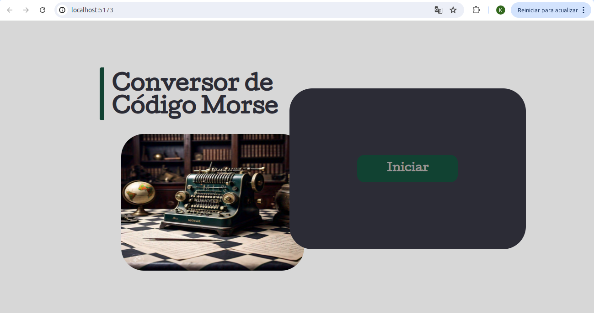
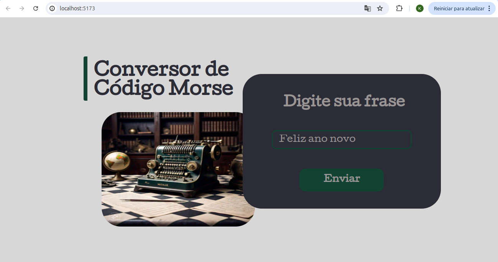
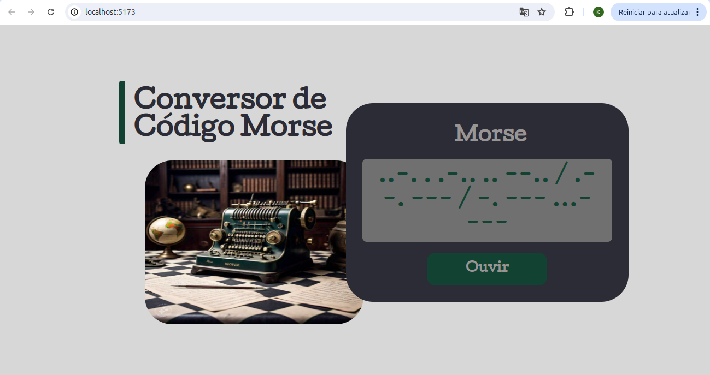

# Conversor de Código Morse - Desafio de Lógica

Este projeto converte uma string em código Morse. A ideia surgiu como um desafio de lógica, e a implementação envolve React + TypeScript para o front-end, Styled Components para o estilo, e a biblioteca Tons para a funcionalidade de áudio.

## Requisitos

<details>
<summary><strong>👨‍💻 Desafio de Lógica</strong></summary>
<br />

- Implemente uma função chamada `convertToMorse` que recebe uma frase em string e a converte em código Morse.
- Cada letra deve ser separada por um espaço, e cada palavra por uma barra (`/`).
- A pontuação e os números podem ser ignorados.

**Exemplo:**

**Entrada:** "código e vida"

**Saída esperada:** 

` -.-. --- -.. .. --. --- / . / ...- .. -.. .- `
</details>

## Deploy

💡 Confira o deploy do projeto [Conversor Morse](https://projeto-codigo-morse.vercel.app/).

## Rodando o Projeto
Para rodar o projeto localmente, use o comando:

```bash
npm run dev
```






